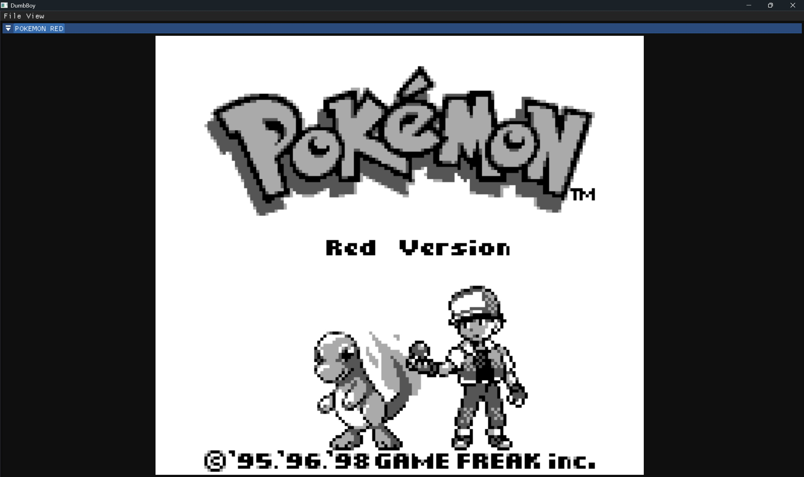
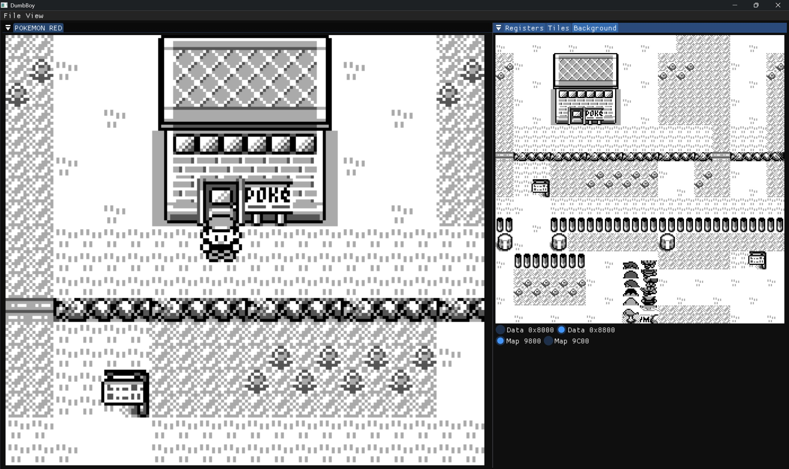
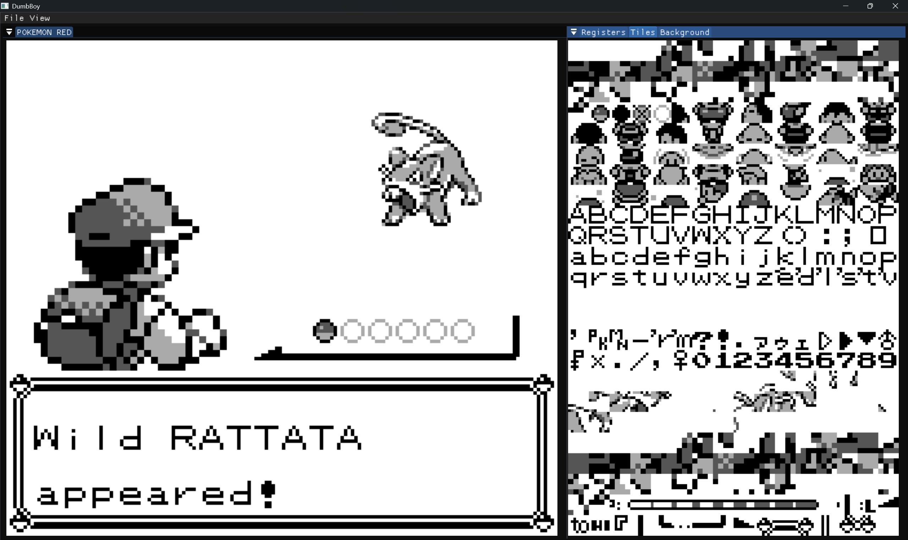

# **GameBoy Emulator**

## Table of Contents

- [Overview](#overview)
- [Screenshots](#screenshots)
- [Features](#features)
- [Installation](#installation)
- [Usage](#usage)
- [Resources](#resources)

## Overview

A fun side project on emulating an original Gameboy (and possibly Gameboy color) using C++. It uses the SDL3 library for rendering as well as Dear ImGui for UI, (Specifically the docking branch, as its pretty cool)

[SDL/SDL3](https://github.com/libsdl-org/SDL)
[ImGui](https://github.com/ocornut/imgui/tree/docking)

## Screenshots

## Features

- DMG Emulation
- Debug Windows to inspect Tiles and registers
- Simple Folder Scanning (For gb and gbc roms)
- MBC1, MBC2, MBC3 are available
- Currently Windows Only
- Audio (WIP)

## Installation

- Install [Cmake](https://cmake.org/download/) Minimum 3.24
- Clone the repository:
  
      git clone --recurse-submodules https://github.com/ITaeI/DumbBoy.git ./DumbBoy

### Build Via CommandLine

    cd ./DumbBoy/GBEmu
    mkdir build
    cd build
    cmake ..
    cmake --build . --config Release

     
## Usage

### Keyboard Bindings

| Game Boy | Keyboard |
|----------|----------|
|A         |L         |
|B         |K         |
|Start     |O         |
|Select    |P         |
|Right     |D         |
|Left      |A         |
|Up        |W         |
|Down      |S         |

### Rom Select

When Running the Executable:
- File -> Select Rom -> Input Rom Directory -> Select File -> Load Rom
- .sav Files will be created within the same directory as Rom

## Resources

- Pandocs: https://gbdev.io/pandocs/
- Opcode Reference: https://rgbds.gbdev.io/docs/v0.9.1/gbz80.7
- Opcode Tables: https://gbdev.io/gb-opcodes/optables/
- General GB Emulator Guide: https://hacktix.github.io/GBEDG/
- Complete Gameboy Technical Reference: https://gekkio.fi/files/gb-docs/gbctr.pdf

